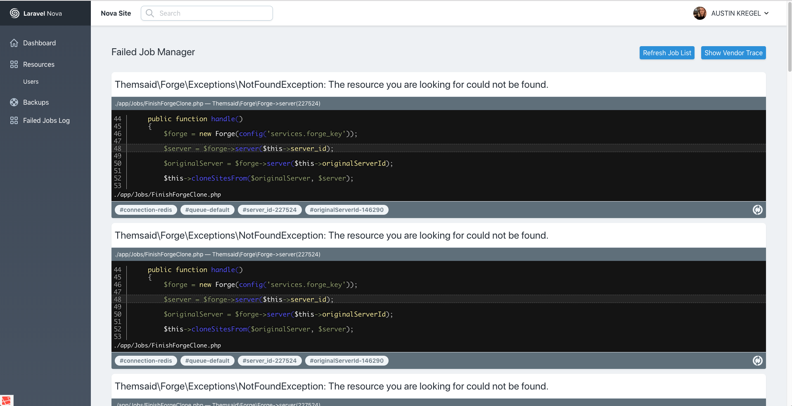

# A Nova tool to help debug failed jobs

[](https://packagist.org/packages/kregel/nova-failed-jobs-tool)
[](https://packagist.org/packages/kregel/nova-failed-jobs-tool)

Ever try to figure out why some job failed? Ever try to do that when you're using SQS? It's a pain isn't it? Well, no more... 

This tool aims to help you figure out why a job might have failed. It gives you relevant code snippets and information about the values pushed through for a given job. You can toggle the stacktrace to view vendor sources, or you can choose to hide them.



## Installation

You can install the package in to a Laravel app that uses [Nova](https://nova.laravel.com) via composer:

```bash
composer require kregel/nova-failed-jobs-tool
```

Next up, you must register the tool with Nova. This is typically done in the `tools` method of the `NovaServiceProvider`.

```php
// in app/Providers/NovaServiceProvider.php

// ...

public function tools()
{
    return [
        // ...
        new \Kregel\NovaFailedJobs\Tool(),
    ];
}
```

## Usage

Click on the "Failed Job Manager" menu item in your Nova app to see the tool provided by this package.

## Contributing

Please see [CONTRIBUTING](CONTRIBUTING.md) for details.

### Security

If you discover any security related issues, please email github@austinkregel.com instead of using the issue tracker.

## Credits

- [Austin kregel](https://github.com/austinkregel)

## License

The MIT License (MIT). Please see [License File](LICENSE.md) for more information.

